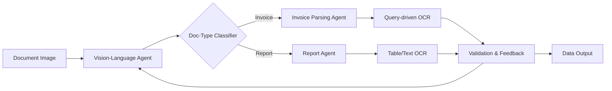

# Executive Summary  
Agentic OCR is an emerging paradigm in document AI where a system **reasonably plans, queries, and self-corrects** its own OCR pipeline, instead of blindly converting entire pages to text. Unlike traditional OCR or template-based IDP (Intelligent Document Processing), agentic OCR is *goal-driven and iterative*: it extracts *only what’s needed* via queries, grounds each extraction in the image, and loops (plan–extract–verify) until confident【1†L262-L270】【10†L133-L142】.  Modern “agents” combine large vision–language models (VLMs) with specialized tools (layout detectors, table parsers, etc.) and often perform multi-step reasoning (e.g. diagnosing errors, rerunning OCR on zoomed regions)【1†L262-L270】【3†L30-L42】. This **shift-left** approach aims to reduce cost and drift (fewer tokens, minimal pre-processing) by tightly coupling extraction to understanding. As of 2026, it’s still an active research area: new open benchmarks (ParseBench, OmniDocBench, OlmOCR-Bench) and toolkits (OpenDataLab’s MinerU/AgenticOCR, IBM’s Docling/Granite, LlamaIndex’s LlamaParse) have emerged【29†L229-L238】【50†L27-L36】. 

Key differences vs. traditional OCR/IDP are summarized below:

- **Scope of extraction:** Traditional OCR/IDP processes full pages with fixed templates, then post-validates; agentic OCR extracts selectively via *queries*, only parsing pertinent regions or fields【10†L133-L142】【1†L290-L298】.  
- **Adaptability:** Template-based pipelines break on layout changes, whereas agentic systems use VLM reasoning to adapt to new formats “on the fly”【1†L290-L298】.  
- **Multimodality & grounding:** Agentic OCR explicitly links extracted text to its image source (provenance) and can interpret charts/graphics as needed. It uses vision–language grounding to maintain audit trails【1†L262-L270】【29†L311-L319】.  
- **Self-correction loop:** Agentic systems review outputs for errors, re-invoke tools (e.g. zoom and OCR, table agent) when confidence is low, and may involve human checks (HITL). Traditional pipelines rarely have this feedback loop【1†L276-L280】【3†L30-L42】.  
- **Integration:** Agentic OCR blurs into end-to-end document processing (enrichment, decision, RAG, etc.), whereas legacy OCR was a standalone, pre-processing step【1†L299-L303】【46†L498-L507】.  

Below we review the **evolution, architectures, and attributes** of agentic OCR (2024–2026), highlight major vendors and open projects, and discuss its strengths and limitations. We also catalog relevant benchmarks (e.g. ParseBench【29†L229-L238】, olmOCR-Bench【39†L1-L4】【39†L13-L16】), performance metrics, and best practices for evaluation. 

## From Traditional OCR to Agentic OCR (Timeline)  
- **Classic OCR (2000s–2010s):** Early OCR tools (e.g. Tesseract) and commercial engines (ABBYY FineReader) focused on character recognition. They often output raw text or required rigid templates. Accuracy was limited on multi-column layouts, tables, or handwriting【1†L215-L224】.  
- **Layout-Aware Pipelines (2015–2022):** Newer systems used deep learning for segmentation (e.g. DocLayNet【30†L49-L57】), table extraction (TableNet, PubTabNet【29†L315-L322】) and end-to-end models (Grobid for documents, LayoutLMX for PDFs). These improved extracting structure from complex documents but still fed nearly all content to downstream steps.  
- **Vision-Language Models (2023–2024):** The advent of large VLMs (GPT-4o, Gemini, Qwen-VL) enabled OCR to “understand” as it reads. Models like AI2’s olmOCR (2024) began outputting structured markdown/HTML in one pass, scoring ~80+ on rich OCR benchmarks【39†L1-L4】【39†L13-L16】. IBM’s Docling (2024) and similar toolkits combined specialized modules to produce unified document representations【13†L83-L93】. This era showed that high-quality OCR was largely solved *technically*, shifting focus to semantic correctness.  
- **Agent Frameworks & Multi-Agent Systems (2024–2026):** By 2024, general AI agents (LangChain, LlamaIndex agents) started to orchestrate VLMs and OCR tools. Vendors and researchers began describing “agentic OCR”: pipelines that iteratively issue queries (e.g. via LLMs) to parse documents dynamically【10†L133-L142】【1†L262-L270】. OpenDataLab’s AgenticOCR (2026) and LlamaParse are concrete examples. At CVPR 2025, OpenDataLab introduced OmniDocBench【45†L444-L453】, a 1.6K-page dataset for benchmarking end-to-end parsing. 2026 papers (Wang et al. 2026) propose **capability/memory reflection** loops for VLMs (repeatedly diagnosing and correcting OCR outputs)【3†L30-L42】. New model releases like IBM’s Granite-Docling (258M, 2025) and Mistral’s OCR service (2025) exemplify the trend toward tiny, efficient VLMs specialized for document conversion【50†L27-L36】【52†L34-L46】. 

## Defining Agentic OCR  
**Agentic OCR** refers to document parsing systems that are *goal-driven* and *self-directed*. Key characteristics include:  

- **Query-Driven Extraction:** Instead of scanning all text, the agent issues targeted prompts (e.g. “Extract table with inventory data”) and only OCRs relevant regions【10†L133-L142】. This saves cost (fewer tokens) and aligns processing with the immediate task (e.g. feeding a retrieval or an LLM agent).  
- **Multimodal Reasoning:** The agent combines vision and language models to interpret both text and visuals. For example, it may use a scene-layout detector to find tables/charts, then call a specialized table-parsing agent on those regions【1†L276-L280】. Each output element (field, number) is grounded to its image coordinates for auditability【29†L311-L319】.  
- **Iterative Self-Correction:** Outputs are validated internally. If confidence is low or constraints fail (e.g. total mismatch in a table sum), the agent may re-run OCR on a zoomed-in image, switch to a different tool, or reformulate its query【3†L30-L42】【39†L1-L4】. In practice, this often takes the form of “Capability Reflection” (diagnose errors) and “Memory Reflection” (avoid repeating mistakes) loops【3†L30-L42】【3†L76-L84】.  
- **Contextual Awareness:** Agents can use external knowledge or databases to enrich or verify extraction. For example, missing fields (like a PO number) can trigger a lookup in an ERP system【46†L368-L376】【46†L382-L390】. This crosses into RAG territory: agentic OCR is typically not the final step but part of an intelligent pipeline that may include context retrieval.  
- **Provenance & Confidence:** Each extracted element is tagged with confidence scores and source coordinates【29†L311-L319】. Agentic systems often flag uncertain or anomalous results for human-in-the-loop (HITL) review, leveraging *confidence gating*.  

**What it solves vs. does not:** Agentic OCR dramatically reduces the brittleness of legacy IDP. It handles layout changes and varied documents (e.g. different invoice formats) without manual retraining【1†L290-L298】. It also compresses input for LLMs by parsing only needed segments【10†L133-L142】. However, it does **not** magically solve domain reasoning or semantic inference – the agent still needs valid rules or models for decision-making. It cannot replace business logic or guarantee 100% accuracy. Common failure modes include hallucinated table structure, dropped content under occlusion, and overconfidence in ambiguous text【29†L229-L238】【32†L1330-L1338】. Careful evaluation (see below) and human review for critical fields remain best practice.

## Key Attributes of Agentic OCR  
Agentic OCR systems are characterized by the following attributes (many dimensions introduced by recent benchmarks【29†L229-L238】【57†】):

- **Selective (Query-Driven) Parsing:** Parse only the fields or sections relevant to the task【10†L133-L142】. This means the system often uses initial prompts (or GUI inputs) to focus on specific bounding-box regions or query slots, avoiding wasteful full-page OCR.  
- **Multimodal Grounding:** Every extracted token is tied back to its image pixel region. This visual grounding ensures traceability (critical for audit or regulation)【29†L311-L319】. It also enables cross-checks (e.g. confirming numeric fields by re-reading in a higher-resolution crop).  
- **Iterative Tool Use:** Agentic OCR may call multiple specialized tools (table parsers, form extractors, even language models) in sequence. For example, it might use a document classifier to identify type (invoice vs form), then launch different sub-agents accordingly【1†L276-L280】.   
- **Provenance and Metadata:** Outputs carry metadata (page number, coordinates, orientation) and provenance chains. Confidence scores and “tags” (e.g. language, script) help gate errors. This contrasts with traditional OCR which often emits just raw text or word boxes with minimal confidence information.  
- **Query-Answering Integration:** Agentic OCR often sits inside a larger AI-agent. It might parse only the answer to a question (QA over documents) rather than the full document. In retrieval-augmented-generation, the agent might iterate: retrieve candidate pages, then parse fragments relevant to a query【10†L133-L142】.  
- **Human-in-the-Loop (HITL):** A mature agentic pipeline usually has HITL checkpoints for edge cases. Annotators can correct or confirm extractions, and the agent learns from this feedback. Some systems (e.g. ParseBench’s annotation pipeline) even interleave LLM outputs with human review to ensure quality【29†L274-L282】.  
- **Efficiency and Drift Resilience:** By focusing on dynamic queries and grounding, agentic OCR is less affected by long-tail format drift. Since it does not rely on brittle template matching, minor layout changes do not necessarily break it. However, this agility comes at the cost of more compute (multiple model calls), so trade-offs between latency/cost and accuracy must be managed【52†L34-L46】【39†L1-L4】.  

  
*Figure: ParseBench (2026) illustrates five “dimensions” crucial for agentic OCR in enterprise workflows: Tables (merging/hierarchy), Charts (exact data extraction), Content (no omissions), Semantic formatting (strikethrough/superscript), and Visual Grounding (traceability)【29†L230-L238】【57†】.*

## Architecture and Pipelines  

**Traditional Pipeline:** Classic OCR/IDP is a linear pipeline:  
```
Document Image → (1) Preprocessing (deskew, denoise) → (2) OCR Engine (Tesseract/CNN) → (3) Layout Analysis (paragraphs, blocks, tables by rule) → (4) Template Parsing or ML Extraction → (5) Data Validation/Export
```  
This pipeline is **mono-modal and one-shot**. It processes everything blindly and then tries to map to fields via fixed rules or ML models. New document types require retraining or re-engineering templates.

**Agentic OCR Pipeline:**  In contrast, an agentic pipeline is dynamic and often multi-agent. A simplified view:  



1. **Agent Controller:** A master agent (LLM or rule engine) first **classifies the document** and formulates tasks.  
2. **Specialized Sub-Agents:** Depending on type, it dispatches to sub-agents: e.g. a “table agent” that focuses on extracting tabular data (running an OCR model on each detected table and returning JSON), or a “form agent” that populates fields via QA prompts.  
3. **Iterative Loop:** Each sub-agent may loop: if output fails consistency checks (sums don’t match, required fields empty), it reforms the query (e.g. “re-extract total with zoom on bottom-right”) or tries an alternative model. This loop continues until confidence is high.  
4. **HITL & Logic:** The controller can route uncertain cases to humans or apply business rules (e.g. cross-check with a database).  

By comparison, a **multi-agent computer-vision toolchain** (not necessarily agentic) might have parallel modules (image OCR, table detector, chart parser) with a fusion step. Agentic OCR sits atop this: it decides which modules to run when and how to integrate their outputs in a goal-focused way.

## Position in IDP/Document AI Stacks  
Agentic OCR lives at the *front end* of modern IDP/Document AI pipelines, but with greater overlap into the “understanding” layer:

- **Below:** It still consumes raw docs (scanned PDFs, images) and typically includes a core OCR component (often a VLM-based OCR) plus layout analysis.  
- **Alongside:** It merges capabilities of layout analysis, field extraction, and semantic parsing into one framework. In an IDP stack, where traditional OCR fed into RPA or business rules, agentic OCR feeds directly into LLM agents, RAG systems, or automated workflows【46†L498-L507】.  
- **Above:** Because of its goal orientation, agentic OCR often outputs not just raw data but actionable intelligence: structured JSON, database updates, or even triggered workflows. For example, UiPath’s recent “agentic document processing” demos show invoices being autonomously approved via integration with ERP (all driven by an OCR+LLM agent)【46†L368-L376】【46†L382-L390】.  

In effect, agentic OCR *collapses the gap* between low-level text extraction and high-level understanding. It is sometimes referred to as “AI Document Extraction Agents” or “Document AI agents”, reflecting its role in intelligent workflows.

## Major Players and Projects  

Below is a non-exhaustive list of notable players (cloud providers, vendors, OSS) in the agentic/document OCR space (as of 2026):

| **Name**            | **Type**      | **Approach**            | **Features**                                    | **License / Stage**                    | **Links**                                 |
|---------------------|---------------|-------------------------|-------------------------------------------------|----------------------------------------|-------------------------------------------|
| *Google Document AI* | Cloud (GCP)   | ML-based IDP           | Pretrained form/key-value/table extraction     | Proprietary (GA)                       | [Docs](https://cloud.google.com/document-ai) (no direct citation)           |
| *AWS Textract*     | Cloud (AWS)   | ML-OCR & KVP extraction | OCR, tables, forms, handwriting (pretrained)   | Proprietary (GA)                       | 【21†L55-L64】 (marketing page)            |
| *Azure Document Intelligence* | Cloud (Azure) | ML-OCR & IDP | OCR, tables, KVP, forms via REST API           | Proprietary (GA)                       | 【24†L1-L9】 (official page)                |
| *Mistral Document AI* | Cloud/ML | VLM-based OCR service  | “OCR 3” model (99%+ accuracy, 2k ppm)          | Proprietary (beta/GA in 2025)          | 【52†L34-L46】 (promo page)                |
| *IBM Granite-Docling* | OSS Model   | VLM-based parsing      | End-to-end doc conversion; outputs “DocTags”    | Open Source Apache-2 (HF)              | 【50†L27-L36】【50†L90-L100】              |
| *LlamaIndex LlamaParse* | Commercial | Agentic OCR service | VLM agent framework (integrates GPT/Vision)    | SaaS/commercial                        | (see LlamaIndex blog)                     |
| *OpenDataLab AgenticOCR* | OSS      | VLM+QA-driven         | Query-driven, selective OCR (code on GitHub)   | Open (GitHub)                          | 【10†L83-L92】【10†L133-L142】             |
| *IBM Docling (library)* | OSS      | Modular parsing toolkit| Ensemble of specialized parsers (tables, etc.) | Open (MIT)                             | 【13†L83-L93】                             |
| *OpenDataLab MinerU*   | OSS       | LLM-ready OCR pipeline | Multi-format to Markdown/JSON for LLMs         | Open (Apache-2)                        | 【8†L328-L337】【8†L386-L395】            |
| *AllenAI olmOCR*      | OSS Model  | LLM fine-tuned OCR     | VLM outputs Markdown/HTML; unit-test trained   | Open weights (Qwen base)               | 【38†L109-L118】【39†L13-L16】             |
| *Nanonets, Rossum, Hyperscience* | SaaS/OSS | IDP platforms | Classical IDP with some AI (forms, tables)     | Commercial                             | (public info)                             |
| *ABBYY Vantage*      | Commercial   | IDP + GenAI           | Document classification, OCR, extraction + GenAI | Commercial                           | 【56†L17-L22】 (vendor site)              |
| *Tesseract, PaddleOCR, OpenCV, OCRmyPDF* | OSS | Traditional OCR   | Character/text recognition only               | Open                                   | (standard libraries)                     |

Key points: Most big cloud OCR (AWS/Google/Azure) are still “black box” OCR+form extraction and do not natively support agentic loops. New VLM-first solutions (e.g. Granite-Docling, olmOCR) push the envelope by outputting richly structured formats. Several open benchmarks and repositories have sprung up to track progress (see below).

## Benchmarks and Evaluation Repositories  

Several **benchmarks/arenas** have been introduced to measure how well OCR systems meet agentic needs:

- **ParseBench (2026)**【29†L229-L238】: A 2,000+ page benchmark of real enterprise documents (finance, insurance, gov’t) annotated for five dimensions: *table structure*, *chart data*, *content faithfulness*, *semantic formatting*, *visual grounding*. It emphasizes **semantic correctness** (e.g. exact data-point match, structural table matching) over surface text overlap【29†L230-L239】. The dataset and evaluation code are open (HuggingFace/GitHub【29†L233-L239】【29†L317-L324】). On ParseBench, LlamaParse’s agentic pipeline currently leads (~84.9% overall)【36†L297-L305】, with VLMs strong on content but weak on charts/grounding【29†L239-L248】【36†L297-L305】. *Leaderboard:* https://parsebench.ai (see Fig above)【57†】.  
- **olmOCR-Bench (2025)**【39†L1-L4】: Developed by AI2, it uses deterministic “unit tests” (programmatic verifiers) to check OCR outputs (table structure, math accuracy, reading order)【38†L123-L132】. AllenAI reports olmOCR-2 achieving ~82.4 on this benchmark【39†L1-L4】. The benchmark code is not fully public, but model cards list scores for known systems. The key idea is aligning training with verifiable metrics【38†L123-L132】【39†L13-L16】.  
- **OCRBench v2 (2025)**【42†L52-L61】: A large bilingual benchmark (English/Chinese) focusing on *text-intensive* tasks (localization, handwritten text, reasoning). It finds that state-of-the-art LMMs still score low (<~60% overall) and fail on rare scripts, layout understanding, etc【43†L1-L4】. It provides comprehensive metrics and private test sets. (Project: https://99franklin.github.io/ocrbench_v2).  
- **OmniDocBench (2025)**【45†L444-L453】: CVPR 2025 dataset (1,651 pages) covering diverse languages and layouts. It includes block-level annotation for paragraphs, formulas, tables (with HTML/LaTeX), plus reading order. It uses a hybrid matching metric (normalized edit distance, CDM for formulas). The GitHub (OpenDataLab/OmniDocBench) contains data, code, and an evolving public leaderboard.  
- **Enterprise-centric Micro-benchmarks:** Ongoing evaluations like FinRAGBench and MMLongBench (mentioned by Wang et al. 2026【10†L83-L92】) focus on retrieval scenarios over financial documents.  

These benchmarks highlight that **no single system dominates all aspects**. For example, ParseBench found VLMs excel at text but struggle with exact table/chart output【29†L239-L248】, whereas specialized parsers better capture structure but may hallucinate or mis-format. **Key evaluation metrics** in these benchmarks include: F1 on structured fields, table TEDS/GTRM for records, exact match of chart data points, formatting correctness, and token-level grounding scores【29†L229-L238】【43†L1-L4】. Best practice is to use multiple metrics (including downstream task success) rather than raw OCR accuracy alone. 

## What Agentic OCR Solves – and Doesn’t  

**Solves:**  
- **Template brittleness:** Agentic OCR can adapt to new document formats without retraining. By reasoning over document context and content, it is far more flexible than fixed-template IDP【1†L290-L298】【10†L133-L142】.  
- **Selective cost:** In retrieval or QA tasks, it parses only needed text (shift-left in pipeline), greatly reducing token and compute cost downstream【10†L133-L142】.  
- **Complex data extraction:** It can recover nested structures (merged table cells, multi-column text) and charts more reliably by using targeted methods per element, rather than monolithic heuristics【29†L230-L238】【57†】.  
- **Auditability:** With explicit grounding, every datum can be traced back for compliance. Agents can also enforce provenance requirements automatically (e.g. “show source image of this figure”).  
- **Continuous improvement:** Agentic systems naturally accommodate feedback (re-run queries, fine-tune with new examples) and can use self-diagnostic loops (as shown by OCR-Agent)【3†L30-L42】.  

**Limitations:**  
- **Not a full solution:** It doesn’t inherently understand domain logic. Complex business decisions (credit approval, legal compliance) still require explicit rules or expert AI. Agentic OCR may identify anomalies but won’t autonomously decide correctness beyond hard-coded rules.  
- **Latency/Compute:** Multiple model calls (especially for large VLMs) increase runtime. There’s a trade-off: parsing on-demand saves tokens but can incur many sequential LLM calls. Careful batching and concurrency (or “cost-effective” modes like LlamaParse’s low-compute option) are needed.  
- **Reliance on model capabilities:** Hallucinations are possible (e.g. misreading a skewed line as similar text elsewhere). Current VLMs can still miss tiny text or unusual fonts. Confidence gating and optional fallback to legacy OCR can mitigate but not eliminate errors.  
- **Data drift:** While more robust to layout drift, agentic OCR still requires quality training data for its models. A new document type with, say, entirely different languages or scripts will challenge a non-multilingual agent (though some models like Granite-Docling are adding languages【50†L119-L128】). Continuous evaluation is needed.  
- **Overdependence on LLMs:** Agents built on closed LLM APIs can be brittle to API changes or cost spikes. Also, licensing (“ML license cost”) of using a large VLM for every query can be nontrivial for high-volume use cases.  

**Misconceptions:** Some hype materials imply agentic OCR “reads and understands documents like a human”【46†L399-L407】 – but in reality it only understands well enough to extract and validate text/data. It doesn’t perform human-like comprehension of nuances (e.g. it won’t autonomously write the correct legal interpretation of a contract). Another pitfall is assuming “no human review is needed.” In practice, critical fields (prices, totals) should still be double-checked, as agentic OCR can get these wrong (albeit less often than legacy OCR). Finally, some may think “template IDP vs agentic” is a one-size battle; in fact many production systems mix approaches (using agentic steps for complex pages and fallbacks for simple, or combining agentic OCR with classic OCR for speed).

## Best Practices and Evaluation Methodology  
Based on current research and deployments, recommended practices include:  
- **Design for queries:** Define your extraction goals explicitly (field list, table structures, or natural-language questions). Agentic OCR works best when the “prompt” or query is clear; vague tasks produce unpredictable output.  
- **Incremental validation:** Use intermediate checks (sums, regexes, consistency rules) to trigger iterations. For example, if an “invoice total” field fails a tolerance check, have the agent re-extract or escalate.  
- **HITL loops:** Especially in high-stakes domains (finance, legal), integrate human review for low-confidence cases. Human corrections should feed back into the agent (fine-tuning) over time.  
- **Latency engineering:** For throughput-critical pipelines, consider hybrid strategies: e.g. first run a fast lightweight OCR (like WhisperVision or break threads), then only call heavier agents when needed. Also exploit “Cost-Effective” model modes or smaller models where fine detail isn’t needed.  
- **Monitor drift:** Even though agentic OCR is adaptable, you should regularly benchmark it on fresh data (using splits of new invoices, reports) to detect any performance decay. Tools like ParseBench encourage continuous evaluation on the five dimensions.  
- **Metric-driven tuning:** Evaluate on semantic metrics, not just character error rate. Use benchmarks that measure structural correctness (e.g. Table TEDS, Chart values), as these correlate with business impact【29†L230-L238】【39†L13-L16】. For novel agents, custom “unit-test” style metrics (e.g. does each extracted amount sum correctly) are very useful.  

On **evaluation**, we should use multi-faceted metrics as in ParseBench: structural match rates for tables, element-wise accuracy for charts, token-F1 or edit-distance for text content, and explicit checks for formatting tags (strikethrough, superscript)【29†L229-L238】【43†L1-L4】. Reporting results per-dimension (tables, charts, text, format, grounding) gives insight into where a system fails. Public benchmarks (ParseBench, OmniDocBench) are emerging standards. For end-to-end tasks, success might be measured by downstream accuracy (e.g. correct entries in a financial ledger after OCR). 

## References  
This report draws on recent research and industry sources (2024–2026) including vendor announcements, preprints, and benchmarks. Key references include: the LlamaIndex “Agentic OCR” whitepaper【1†L262-L270】【1†L290-L298】; OpenDataLab’s AgenticOCR (2026) study【10†L83-L92】【10†L133-L142】; AllenAI’s olmOCR benchmark blog【39†L1-L4】【39†L13-L16】; IBM’s Granite-Docling launch【50†L27-L36】【50†L90-L100】; ParseBench (2026) arXiv and GitHub【29†L229-L238】【36†L297-L305】; and Mistral’s Document AI page【52†L34-L46】. These primary sources underpin the above analysis. 

